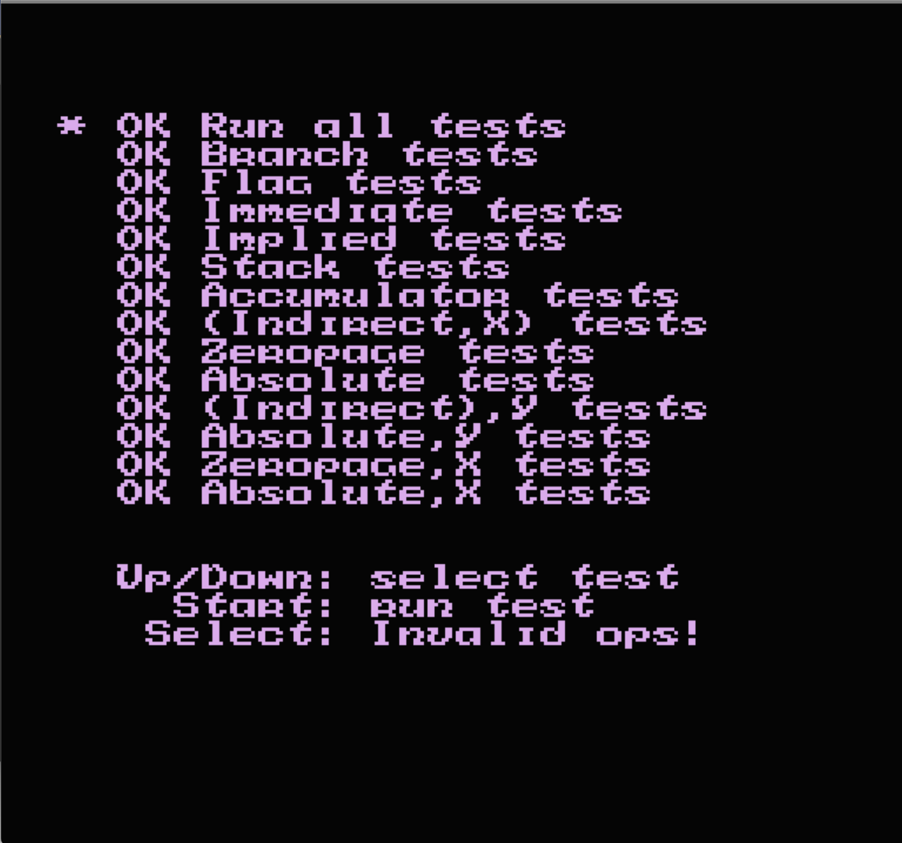

# ファミコンエミュレータ

## 注意！
Visual Studio 2022 上で編集を行っていた際は、フォルダ分けがソフト内での仮想的な管理となっていました。そのため、GitHub への公開にあたっては専用のリポジトリを作成し、実際のディレクトリ構造としてフォルダ分けを行いました。
これに伴い、本プロジェクト上ではヘッダーファイルへのパスが正しく設定されていない状態になっています。

## 動作確認
### nestest（CPUテスト）
  
nesファイル  
https://github.com/christopherpow/nes-test-roms/blob/master/other/nestest.nes  
(この人が作ったものかどうかはわからない)
### snake

### 2048
  
nesファイル  
https://www.romhacking.net/homebrew/65/
